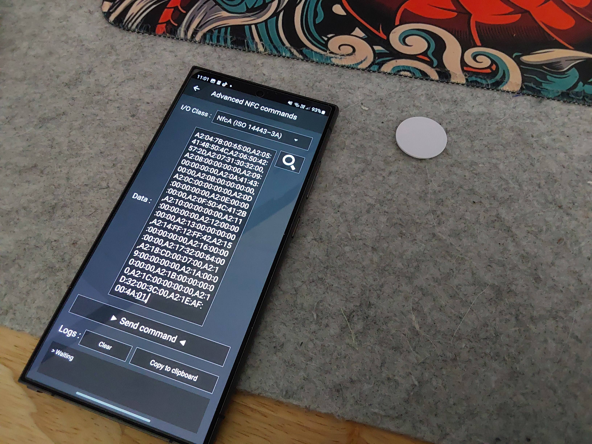
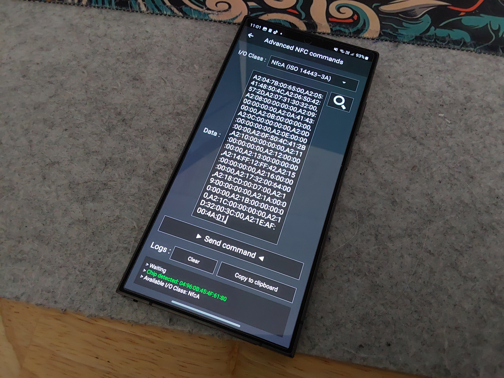

# AnycubicNFCScript

Python script to automatically create a set of NFC commands to colour filament and brand for ACE Pro 

Requires python (and matplotlib) installed

## To use:

1. run python file `python ./main.py`
2. input colour name or enter for hex code
3. it will ask for hex code if you didnt enter a colour, or didnt find the colour (Black #000000 default)
4. input filament type (PLA+ default)
5. will print out NFC commands
 
 
see Tutorial/2025-01-25 10-58-44.mkv for a video guide

 
## To write:

1. open relevant NFC writing tool (I used NFC tools pro)
2. go to other -> advanced NFC commands

3. Paste into box

4. place NFC tag under phone and confirm it detects it

5. send command

 

 * note: it may not show this option if there is too much text, if so you can cut half of the commands out AFTER a comma (,) and paste it as a seperate command

after:

7. attach to filament roll and confirm it works!

### NOTICE: I have tested this by myself using NTAG215 tags and have success, i am not responsible for any damages this causes to you or your equipment.
